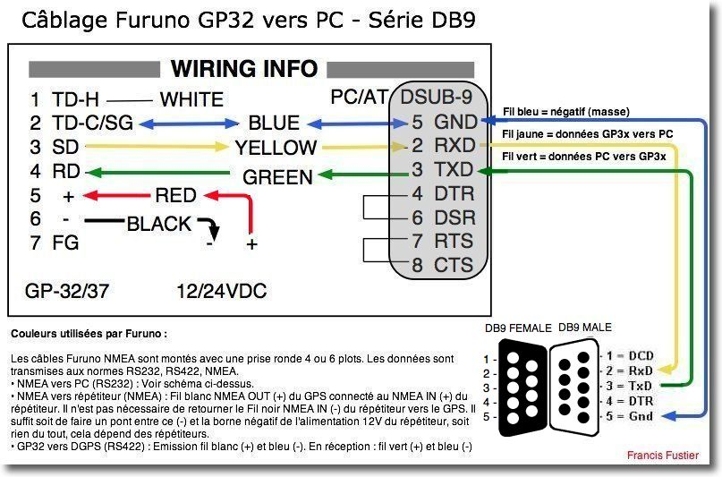
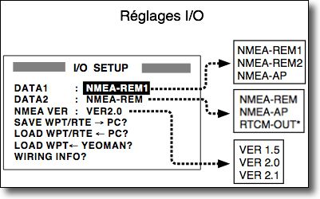

<div id="top"></div>
<!--
*** Thanks for checking out the Best-README-Template. If you have a suggestion
*** that would make this better, please fork the repo and create a pull request
*** or simply open an issue with the tag "enhancement".
*** Don't forget to give the project a star!
*** Thanks again! Now go create something AMAZING! :D
-->

<!-- PROJECT SHIELDS -->
<!--
*** I'm using markdown "reference style" links for readability.
*** Reference links are enclosed in brackets [ ] instead of parentheses ( ).
*** See the bottom of this document for the declaration of the reference variables
*** for contributors-url, forks-url, etc. This is an optional, concise syntax you may use.
*** https://www.markdownguide.org/basic-syntax/#reference-style-links
-->
<!--
[![Contributors][contributors-shield]][contributors-url]
[![Forks][forks-shield]][forks-url]
[![Stargazers][stars-shield]][stars-url]
[![Issues][issues-shield]][issues-url]
[![MIT License][license-shield]][license-url]
[![LinkedIn][linkedin-shield]][linkedin-url] -->

<!-- PROJECT LOGO -->
<br />
<div align="center">

<h3 align="center">GP32 GPS Communication 3000</h3>
<!-- 
  <p align="center">
    Interface which can save and upload waypoint to Furuno GP32 using RS232
    <br />
    <a href="https://github.com/PepinNucleaire/gp32-transfer"><strong>Explore the docs »</strong></a>
    <br />
    <br />
    <a href="https://github.com/PepinNucleaire/gp32-transfer">View Demo</a>
    ·
    <a href="https://github.com/PepinNucleaire/gp32-transfer/issues">Report Bug</a>
    ·
    <a href="https://github.com/PepinNucleaire/gp32-transfer/issues">Request Feature</a>
  </p>-->
</div>

<!-- TABLE OF CONTENTS -->
<details>
  <summary>Table of Contents</summary>
  <ol>
    <li>
      <a href="#getting-started">Getting Started</a>
      <ul>
        <li><a href="#prerequisites">Prerequisites</a></li>
        <li><a href="#installation">Installation</a></li>
      </ul>
    </li>
    <li><a href="#usage">Usage</a></li>
    <li><a href="#roadmap">Roadmap</a></li>
    <li><a href="#contributing">Contributing</a></li>
    <li><a href="#license">License</a></li>
    <li><a href="#contact">Contact</a></li>
    <li><a href="#acknowledgments">Acknowledgments</a></li>
  </ol>
</details>

<!-- GETTING STARTED -->

## Getting Started

This application was created in order to make transfer of GPX files created via OpenCPN easier for GP32 owners.
It features :

- Waypoints saving from the GPS to a NMEA, CSV, or GPX file
- Upload waypoints to the GPS using a GPX file created from OpenCPN (other software may work but not tested)

### Installation

Install `gp32-transfer` with `pip`

```shell
$ pip install gp32-transfer
```

<!-- USAGE EXAMPLES -->

## Usage

### Connection to the computer

Connect the GPS to the computer using a serial port

- Green to TXD
- Yellow to RXD
- Blue to GND
- Connect Red and Black to an external 12V Power Supply



- Set up the I/O settings on the GPS with:
  - `DATA2 : NMEA-REM`
  - `NMEA VER: VER1.5`



### Downloading Waypoints

In order to download the existing list of waypoints from the GP32 to a GPX file :

1. On the GPS, go to `I/O settings`
2. go to `Save WP/RTE -> PC?`
3. On the computer launch a terminal and launch the utility with `import {name of output file}` option

```shell
$ gp32_transfer import test_import.gpx
```

4. Press `Continue` on the GPS
5. Waypoints imported will be prompted on the terminal
6. Wait for the process to be finished
7. You can now import the resulting GPX file in OpenCPN!

### Uploading waypoints to the GPS

Once you have your GPX file exported and ready on Open CPN, follow these steps to import on the GP32 GPS:

1. On the GPS, go to `I/O settings`
2. Go to `Load WP/RTE <- PC ?`
3. Press `Continue` on the GPS (/!\ Pressing this will reset all waypoints and routes currently in the GPS)
4. On the computer launch a terminal and launch the utility with `export {name of GPX file}` option

```shell
$ gp32_transfer export test_export.gpx
```

5. The process will export the waypoints, wait for it to finish
6. Your waypoints are exported to the GPS !

## Troubleshooting

Waypoints should have a strict naming when you make an export to the GPS. See [this document for more insights](doc/gp32/GP32_requirements.md)

### Requirements

- Names have a 6 character length maximum
-

<!-- ROADMAP -->

## Roadmap

- [x] ~~Save waypoints~~
  - [x] ~~Read from GP32~~
  - [x] ~~Save to GPX file compatible with OpenCPN~~
- [x] Upload Waypoints
  - [x] ~~Convert GPX to NMEA~~
  - [x] ~~Upload NMEA to GP32~~
- [x] Make a nice app
  - [x] CLI
  - [] Web-based ?
  - [] Click-n-go ?
- [] Compatitibilty with GP39

See the [open issues](https://github.com/PepinNucleaire/gp32-transfer/issues) for a full list of proposed features (and known issues).

<p align="right">(<a href="#top">back to top</a>)</p>

<!-- CONTRIBUTING -->

## Contributing

Contributions are what make the open source community such an amazing place to learn, inspire, and create. Any contributions you make are **greatly appreciated**.

If you have a suggestion that would make this better, please fork the repo and create a pull request. You can also simply open an issue with the tag "enhancement".
Don't forget to give the project a star! Thanks again!

1. Fork the Project
2. Create your Feature Branch (`git checkout -b feature/AmazingFeature`)
3. Commit your Changes (`git commit -m 'Add some AmazingFeature'`)
4. Push to the Branch (`git push origin feature/AmazingFeature`)
5. Open a Pull Request

<p align="right">(<a href="#top">back to top</a>)</p>

<!-- LICENSE -->

## License

Distributed under the MIT License. See `LICENSE.txt` for more information.

<p align="right">(<a href="#top">back to top</a>)</p>

<!-- CONTACT -->

## Contact

Your Name - [@juju_on_mini](https://twitter.com/juju_on_mini) - muller.julien.02@gmail.com

Project Link: [https://github.com/PepinNucleaire/gp32-transfer](https://github.com/PepinNucleaire/gp32-transfer)

<p align="right">(<a href="#top">back to top</a>)</p>

<!-- ACKNOWLEDGMENTS -->

## Acknowledgments

- [russkiy78 and it furunotogpx project](https://github.com/russkiy78/furunotogpx) that I used as a really big inspiration
- [Navigation-Mac for its images and info on connection of GP32](https://www.navigation-mac.fr/connecter-un-furuno-gp32-a-votre-mac/)
- My dog

<p align="right">(<a href="#top">back to top</a>)</p>

<!-- MARKDOWN LINKS & IMAGES -->
<!-- https://www.markdownguide.org/basic-syntax/#reference-style-links -->
