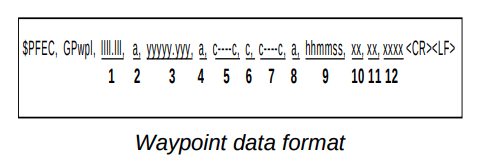
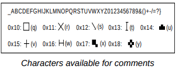
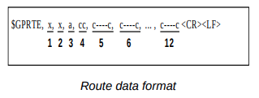

# Requirements for GP32 Transfer

## Manual

See [](GP32_manual.pdf)

## NMEA

The last line of NMEA has to be `$PFEC,GPxfr,CTL,E` in order to complete the transfer

NMEA Settings :

```
Baud Rate:4800 bps
Character Length: 8 bit
Stop Bit:1 bit
Parity:None
X Control:XON/OFF
```

## Waypoint



1. Waypoint latitude
2. N/S
3. Waypoint longitude
4. E/W
5. Waypoint name (Number of characters is fixed to 6 and space code is placed when the number of characters are less than 6.)
6. Waypoint color (This field is always kept NULL.)
7. Waypoint comment (2 byte for mark code + 16 characters of comment.)

   - 1st byte of mark code. Fixed to '@'.
   - 2nd byte of mark code. Internal markcode + 'a' (0 x 61).
   - See Note 1.Number of characters for comment isless than 16 (variable length).
   - See Note 2.

8. Flag making waypoint. Always set to "A"."A". Displayed, "V". Not displayed
9. UTC (Always NULL)
10. Day (Always NULL)
11. Month (Always NULL)
12. Year (Always NULL)

Note 1: Internal mark code is 0 x 10 through0 x 18. 0 x 71 through 0 x 79 are alwaysplaced at 2nd byte of mark code

Note 2:



## Route



1. Number of sentences required for onecomplete route data (1 to 4). See Note.
2. Number of sentences currently used (1 to 4)
3. Message mode (Always set to C).
4. Route No. (01 to 51 (51 is LOG route, 2 digits required)
5. to 12 Waypoint name
   - Max. 8 names, length of each waypoint name is fixed to 7byte)
   - 1st byte: Skip code '-' (Hyphen) = Skip ON, Space code = Skip OFF
   - After 2nd byte: Waypoint name (fixed to 6 bytes)

Note: A route can contain max. 30 waypoints and GPRTE sentence for one route data may exceed 80 byte limitation. In this case, route data is divided into several GPRTE sentences (Max. 4 sentences). This value shows the number of sentences route data has been divided.
